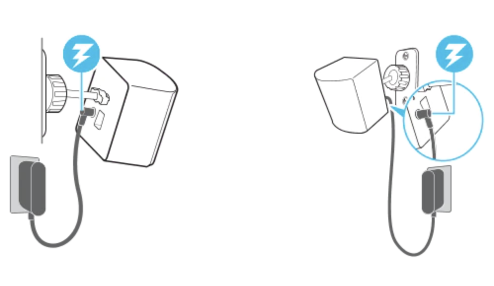
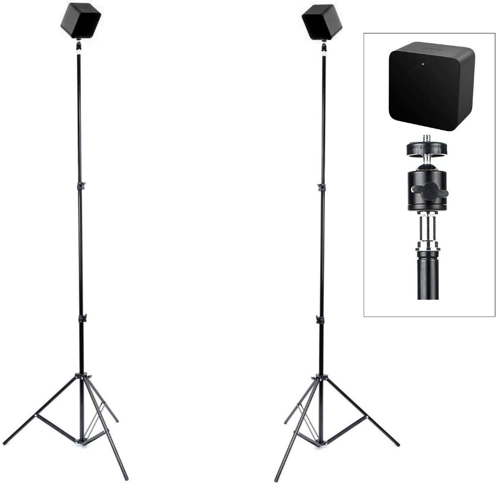

--- 
title: "(UPDATE) Metaverse impact on teamwork"
author: "Power BI Rangers"
date: "`r Sys.Date()`"
site: bookdown::bookdown_site
documentclass: book
bibliography: [book.bib, packages.bib]
# url: your book url like https://bookdown.org/powerBIrangers/bookdown
# cover-image: path to the social sharing image like images/cover.jpg
description: |
  This is a minimal example of using the bookdown package to write a book.
  The HTML output format for this example is bookdown::gitbook,
  set in the _output.yml file.
link-citations: yes
github-repo: rstudio/bookdown-demo
---

# Preface

This page will give an introduction to our manual on topics regarding the Metaverse.
Especifically, this manual will include general information about the Metaverse, its benefits, and how to use it to its potential in various different settings.


```{r include=FALSE}
# automatically create a bib database for R packages
knitr::write_bib(c(
  .packages(), 'bookdown', 'knitr', 'rmarkdown'
), 'packages.bib')
```

<!--chapter:end:index.Rmd-->

# Background Information
*NEED TO UPDATE*


**James' Part**
We see the Metaverse as an inevitable technological revolution in the future. Just as the internet revolutionized communication as we know it today, professionals on the subject expect the Metaverse to do the same. Future MBAn students are more than likely to experience the evolution of this concept and even start utilizing it in their classrooms and workplaces. We envision that our project is going to be a handout on how Metaverse is going to impact each area of our day-to-day lives, especially the transformation from 2D interaction (Zoom/FaceTime) to 3D interaction (metaverse). We are going to start with the principles that lead to more efficient teamwork in 2D, followed by the technological innovation that Metaverse could bring to it, such as tracking eye contact, body language, facial micro-expression, and the elimination of physical distance in 2D interaction. This would result in a more natural and psychologically safe environment than common video call platforms, leading to a more efficient communication and teamwork experience. Under those innovation points, we would include detailed discussions about teamwork in different aspects of our lives where interaction happens, such as Work, Study, Business, Medicine, Social Media, and Traveling.

At the moment, we expect the following to be some of the topics we will include in our handbook:

- How work will look like in the Metaverse
- How will the Metaverse create a better work-life balance
- How will the Metaverse create a more psychologically safe environment
- How simulations in the Metaverse can affect team decision-making, education, and an alternative form of communication through simulations
- The future These, however, are subject to change as 

our research dives more deeply into the topic.
Other than the positive changes that Metaverse will bring to our workspace, we are also expecting to see revolutionary transformation in other relevant areas. For example, we envision that Metaverse will create a new economic environment, with countless business opportunities. With the adoption of Metaverse, we expect to see an upgrade in our current technological devices and software. Everything that we now do online — gaming, social media, entertainment, shopping, will all be altered in order to fit in the Metaverse.

Despite the amazing changes that Metaverse promises, constant exposure to it may also bring potential downsides —- addiction, privacy issues, losing touch with the real world and people, discontinuation of cultures and traditions, etc. In our handbook, we will instruct the future students of MBAn on how to approach Metaverse in moderation.

<!--chapter:end:02-Background.Rmd-->

# Set Up Guide

## Virtual Reality

When VR space is set up, there are three peripherals needed to immerse into virtual reality: Headset provides the VR visual, controllers provide the physical control in VR world, and headphones to give the audio experience. Users need to start up the application on a PC or console before starting a VR simulation. Then, the user can put the headset on and adjust it to fit. Users will also hold the controllers and start to control the experience on screen through their body move and the controllers. Once everything is ready, the user will be immersed in the scene, which will move and interact as if they were in real action.

There are a few steps to set up a VR space before starting to use it:

{width=400}

Step 1 - Make Sure to Have Plenty of Space

It is better to have more space for VR setup, at least 6.5 x 5 feet is recommended. Chairs, tables, and anything you can bump into while using VR should be kept away from the VR space to avoid tripping hazards. You should also consider having enough airspace, for example low ceilings, or dangling ceiling lights that you can easily touch on are not recommended. Finally, try to avoid reflective surfaces and windows while using VR because they might cause tracking issues of the headset and controller and make your view spin out of control.

Step 2 - Setup the Base Station

VR headsets and controllers rely on base stations for tracking their exact locations in order to create the illusion of room-scale immersion in virtual reality. It usually comes with two base stations to help the VR work. To set up Base stations, it needs to be diagonally mounted across from each other and above the head, solidly to avoid wobble. There are few ways to mount the base station. You can choose to mount it into the wall which is the most ideal way to save spaces and usually it’s more stable. 
{width=250}

You can also mount it on camera tripod stands, which you can easily move around, but it will take up floor space and maybe it will get in your way when you use it.

{width=250}

## WiFi and Troubleshooting Help

One recurring problem in today's world is issues with your wireless connection. Like in other consoles and devices, a virtual reality headset will still work without internet connectivity, however, any application that requires wifi will not load properly. If you are inside an app that is dependent on wifi connection, then usually a pop-up appears inside the VR headset screen, and it also usually allows users to try to reconnect/fix the problem without taking the headset off. Nonetheless, the application usually freezes until the problem is solved or the application is closed.

The following are a couple of links created by developers from some of the most popular VR brands that can help if you are having issues with your internet connection or you need troubleshooting assistance in general:

* https://store.facebook.com/help/quest/articles/fix-a-problem/troubleshoot-headsets-and-accessories/trouble-connecting-to-wifi-quest-2-or-quest/

* https://www.vive.com/us/support/vive/category_howto/troubleshooting-headset-display.html 

* https://www.playstation.com/en-us/support/hardware/playstation-vr-troubleshooting/


<!--chapter:end:03-SetUp.Rmd-->

# Educational Use

<!--chapter:end:04-Education.Rmd-->

# Company Use

<!--chapter:end:05-Company.Rmd-->

# Sociocultural Implications

wqejv;oqwejnv

<!--chapter:end:06-Sociocultural.Rmd-->

# Burnout and Health Effects

## Avoiding Burnout

**Create a dedicated workspace in the Metaverse**

In order to set boundaries between work and daily life, people should only put on the working headsets and accessories in a dedicated area of the room. By doing so, people would need to go to the workroom and start working. If the working headsets are put in the relaxing area of the room, people may casually start working, and it will be very hard to set boundaries. If you don’t have clear boundaries, your entire house will end up becoming a workspace, even after hours.


**Set Working hours and strictly follow the schedule**

In remote work space, it is very easy for people to lose track of time, and the condition may be worse in the Metaverse. In a highly realistic Metaverse workspace, people may not notice at the end of a work day, and continue to work after hours unintentionally. Therefore, it is crucial to have strict work hours, and be intentional about it. Although people tend to focus a lot on all their work, people need to keep track of time to avoid burnout.


## Dealing with Health Side Effects
Similar to gaming and social media, using VR too much will likely lead to behavioral addiction. The user or their family/friends would notice that the user’s quality of life is now suffering because of them being involved in VR. The addiction problem may take the form of ignoring everyday tasks, not wanting to engage with family/friends in real life, and getting frustrated when the user doesn't get to use VR. Behavioral addiction can then lead to more mental health issues like mood disorder, stress, depression, and physical health issues like nausea, dizziness, disorientation, motion sickness. 

In order to step out of the negative loop, we suggest that users set a time limit to VR usage everyday. We suggest that the user’s friend or family member should take away the hardware when the time limit is up, so that the user will not be tempted to continue using it. We recommend that the user incorporate time for exercises or other activities that do not involve sitting down staring at the screen. Taking a walk outside, going to the gym, or simply hanging out with friends outside will be immensely beneficial to the user’s mental health. If the user’s addiction problem becomes increasingly out of control, we recommend the user get professional therapy. 

**If you are currently suffering from any sort of behavioral addiction, please refer to these websites for professional guidance:** [SAMHSA](https://www.samhsa.gov/find-help/national-helpline)


<!--chapter:end:07-Health.Rmd-->

# About Us {#cross}

```{r pressure, echo=FALSE, out.width = '100%'}
#knitr::include_graphics("ranger_picture.jpg")

```


## Mengna Wang

{width=250}

Hi, this is Mengna Wang. I grow up from Suzhou China, a place known with a lot of rivers and bridges. I came to the United States 5 years ago, and went to high school and undergraduate at upstate NY. I always wanted to explore new places in the United States, not just for travel but actually stay there and experience everything there, because I stayed in NY for so long. I am super happy about the opportunity to study at University of Michigan, a completely different place than NY, which is kind of a dream come true opportunity hahaha, and I love here a lot so far. My goal for this year is to finish the program successfully and take the most from the program, have fun and make lots of friends!

[Mengna's LinkedIn](https://www.linkedin.com/in/mengna-wang-17a570184/)

## Remona Yu 

{width=250}

Hello, My name is Liyang Yu (Remona). I am from Dalian, China, a beautiful small sea port city in the Northeast part of China. This is my 8th year in the United States. I am a typical ENFP, I love to communicate, love to travel, and love all the possible new surprises that occur in life.

[Remona's LinkedIn](https://www.linkedin.com/in/remona-yu-3b038a17b/)

## Runze Huang

{width=250}

I'm from Dalian, China. I have developed a huge interest in cooking since I went to college. I love making Chinese and French cuisine, and my signature dish is Seared Duck Breast with Orange Sauce. Besides enjoying delicious food, The cooking experience is a great time for me to be with myself and reflect on recent experience. Although I enjoy cooking by myself, I love inviting friends over to have lunch or dinner!

[Runze's LinkedIn](https://www.linkedin.com/in/runze-huang19/)

## Jennifer Feng

{width=250}

Hi I'm Jennifer. I was born in Shanghai, China, on May 3rd, 2000. In 2014, I went to a boarding school in Birmingham, AL.
In May 2022, I graduated from William and Mary with a BBA in Finance and a minor in Economics.
Right now I am starting the MBAn program (Master of Business Analytics) at University of Michigan Ann Arbor. On a less serious note, I love painting and baking. I love the feeling of oil paint on canvas, and the rich smell of baked goods that floods the kitchen when I open the oven door. 

[Jennifer's LinkedIn](https://www.linkedin.com/in/jennifer-feng-9b4415180/)

## Carlo De los Santos

{width=250}

Hola! I am Carlo De los Santos and I was born and raised in the beautiful piece of land called the Dominican Republic. Just recently, I graduated from the University of Michigan with a Bachelor’s degree in Business Administration. At the moment I decided to stay one more year in the best university in the world (Go Blue!) to complete a Master’s degree in Business Analytics at the Stephen M. Ross School of Business. I enjoy playing sports like Ultimate Frisbee and Volleyball, listening to reggaeton and rock music, and traveling.

[Carlo's LinkedIn](https://www.linkedin.com/in/carlo-alberto-de-los-santos-747318204/)


<!--chapter:end:99-AboutUS.Rmd-->

