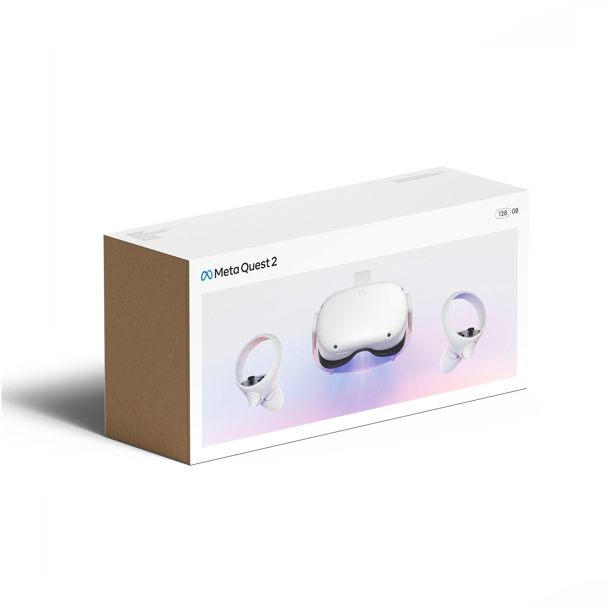
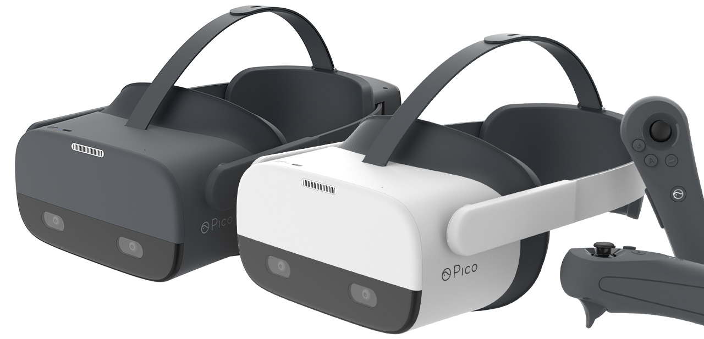
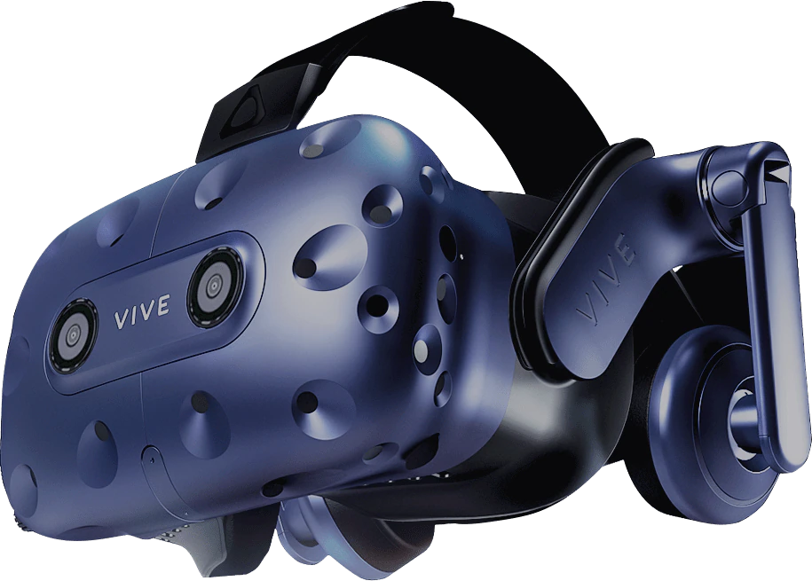

# Background Information

**What is VR**
VR, Virtual Reality, is a technology that simulates the real world in a virtual environment, and there are four important features that define this technology.
Multi-Sensory: 
When people use current technology such as phones, computers, and television, the media generally stimulates them from the visual sensory, because most media is still two dimensional. Although movies now support three, or even four dimensional format, the lack of immersion stagnates the growth of these technologies. In virtual reality, people need to put on headsets and grab controllers to experience the simulated world, which leads to experience in multi-sensory. Other than visual sensory, people would experience auditory sensory, movement sensory, touching sensory, and even tasting sensory. In an ideal virtual reality, people should be able to experience most of the sensory they can experience in the real world
Immersion: 
With the Multi-Sensory feature, people should be able to feel like they are in the real world. Therefore, a sensory experience is evaluated by the level of immersion that the system brings to users. A good virtual reality should give the users a hard time distinguishing the real world from the virtual world. 
Interactivity:
Interactivity determines if Users are able to interact with objects in virtual reality. For instance, if users want to grab an object in virtual reality, the user needs to feel the momentum of grabbing and feel the weight of the object too. 
Imagination
Other than creating a world that highly simulates reality, Virtual Reality gives users the opportunity to create inventions and new ideas that are beyond reality. The ability to create things or life that are not in reality will unleash people’s imagination.

**What is the Metaverse?**

{width=250}
VR is the technology that allows people to enter a virtual environment, and Metaverse is a new social institution that allows people to meet and interact in virtual reality. This new platform allows people to break boundaries and connect with people from around the world. In this manual, you will learn potential ways to utilize the Metaverse as people from different professions. 

**How to get access to Metaverse**

{width=250}

With the VR technology, VR headset and controllers are essential tools to maximize the experience on Metaverse. In fact in 2020, Meta released its own VR headsets, Meta Quest 2, retailed at $399. 

**Comparable products in the market**
Other than the Meta Quest 2, there are a few similar product offerings in the market. This section will list the product, the purchase link and price

* Meta Quest
  + Features: 6DoF, LCD display, 3D positional audio, 1832 x 1920 Resolution Per Eye
  + Price: $399
* Pico Neo 2
  + Features: 6DoF, 4K display, 101° field of view (FOV), built-in spacial stereo speakers
  + Price: $699
{width=250}
* Pico Neo 2 Eye
  + Features: Every Neo 2 features plus an eye-tracking technology
  + Price: $899
* HTC Vive
  + Features: Single front-facing camera, adjustable velcro straps, uses an HDMI to connect to your machine, 2160 x 1200 resolution
  + Price: $899
{width=250}
* Valve Index
  + Key Features: 130° FOV, 6DoF, externalized audio, 2880 x 1660 resolution, canted lens design
  + Price: $999

