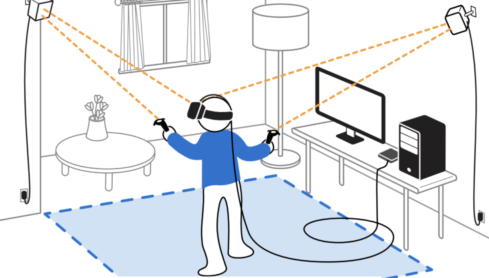
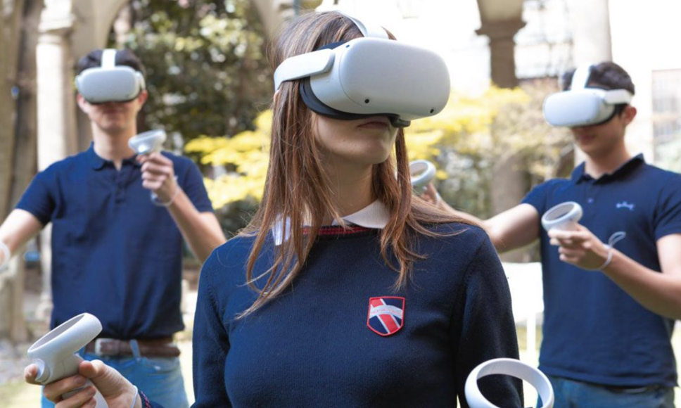
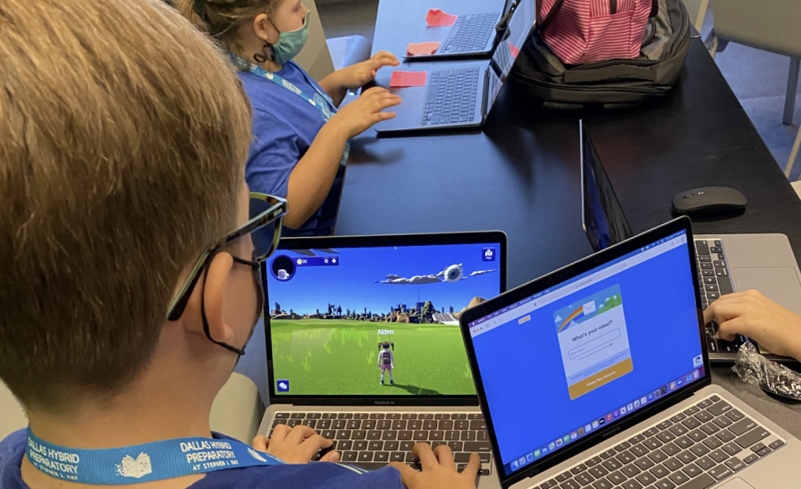
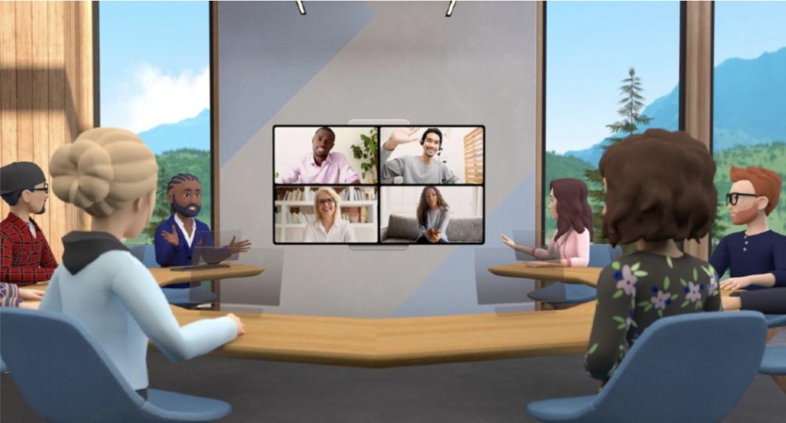

# Set Up Guide

## Virtual Reality

When VR space is set up, there are three peripherals needed to immerse into virtual reality. The headset provides the VR visual, the controllers provide the physical control in VR world, and the headphones give the audio experience. Users need to start up the application on a PC or console before starting a VR simulation. Then, the user can put the headset on and adjust it to fit. Users will also hold the controllers and start to control the experience on screen through their body move and the controllers. Once everything is ready, the user will be immersed in the scene, which will move and interact as if they were in real action.

**Make Sure to Have Plenty of Space before using VR**

{width=400}

It is better to have more space for VR setup, at least 6.5 x 5 feet is recommended. Chairs, tables, and anything you can bump into while using VR should be kept away from the VR space to avoid tripping hazards. You should also consider having enough airspace, for example low ceilings, or dangling ceiling lights that you can easily touch on are not recommended. Finally, try to avoid reflective surfaces and windows while using VR because they might cause tracking issues of the headset and controller and make your view spin out of control.

**Different types of VR devices**

* Standalone devices, such as Meta Quest, that do not need to connect to the computer, but can download content directly from the internet to make it work 

* Another types such as HP headsets needs to connect to the computer to create virtual reality environment

However, VR headsets are not necessary, any laptop or smartphone can help people easily enter the Metaverse through different platforms. 

## Classroom & Business Integration

**How do schools integrate the Metaverse experience in classes?**

{width=500}

Like we mentioned above, the Metaverse provides an interoperable experience that combines the digital world with the physical world. More and more industries started to explore the Metaverse as one of their resources; some schools are beginning to use it as their teaching tools to provide a better learning experience for students through immersive experiences. Schools mainly get access to the Metaverse through different platforms and resources such as ISTE from the company Roblox, STEMuli metaverse, Labster (a virtual labs and science simulations platform), ENGAGE, and Mozilla Hubs (VR platforms that provide a simulated environment for virtual collaboration). For example, the first school which uses a Metaverse platform in class is called Dallas Hybrid Prep. The school is cooperating with STEMuli Metaverse and allows students to join the class and complete assignments from home through their laptops or tablets.

{width=500}

[“Our fifth-grade students join with their teachers while learning from home to collaborate and complete gaming-style assignments, using avatars and earning online currency for completing the assigned tasks” ](https://edtechmagazine.com/k12/article/2022/06/metaverse-already-here-and-k-12-schools-are-using-it-education#:~:text=The%20metaverse%20allow%20educators%20to,still%20need%20to%20be%20addressed)- Olga Romero, founding principal at Dallas Hybrid Prep. Besides, with the VR headsets and controllers will make the experience more immersively in class, which also allows students to interact with each other even if they are thousands of miles apart. With VR technology, students can do things such as virtual field trips, explore the human body, as well as a tool for art and creativity. Nowadays, two major players Meta and Roblox are investing heavily to expand the Metaverse in education. Meta is investing $150 million in Mera Immersive Learning, while Roblox is investing millions of dollars to help different educational organizations create virtual learning experiences.

**How do businesses integrate the Metaverse experience in the workplace?**

{width=500}

In the business world, similar to the school settings, companies usually create online in-office experiences through the Metaverse, employees can move and interact with each other with an avatar in the virtual office place by using VR headsets. For example, With [NextMeet’s immersive platform](https://hbr.org/2022/04/how-the-metaverse-could-change-work), employee digital avatars can pop in and out of virtual offices and meeting rooms in real-time, walk up to a virtual help desk, give a live presentation, relax with colleagues in a networking lounge, or roam a conference center or exhibition using a customizable avatar. Participants access the virtual environment via their desktop computer or mobile device, pick or design their avatar, and then use keyboard buttons to navigate the space: arrow keys to move around, double click to sit on a chair, and so forth.

It shows that the immersive working experience is more productive than the traditional way. [Accenture has announced to onboard 150,000 new hires](https://www.communicationstoday.co.in/accentures-150k-new-hires-to-work-from-metaverse/) who will use VR headsets to work from the Metaverse on their first day. The company's virtual campus on the Metaverse is called the Nth floor, and people will meet, collaborate and learn there. The immersive experience is said to be 30-40% more productive than traditional ways of learning.

## WiFi and Troubleshooting Help

One recurring problem in today's world is issues with your wireless connection. Like in other consoles and devices, a virtual reality headset will still work without internet connectivity, however, any application that requires WiFi will not load properly. If you are inside an app that is dependent on WiFi connection, then usually a pop-up appears inside the VR headset screen, and it also usually allows users to try to reconnect/fix the problem without taking the headset off. Nonetheless, the application usually freezes until the problem is solved or the application is closed.

The following are a couple of links created by developers from some of the most popular VR brands that can help if you are having issues with your internet connection or you need troubleshooting assistance in general:

* https://store.facebook.com/help/quest/articles/fix-a-problem/troubleshoot-headsets-and-accessories/trouble-connecting-to-wifi-quest-2-or-quest/

* https://www.vive.com/us/support/vive/category_howto/troubleshooting-headset-display.html 

* https://www.playstation.com/en-us/support/hardware/playstation-vr-troubleshooting/

