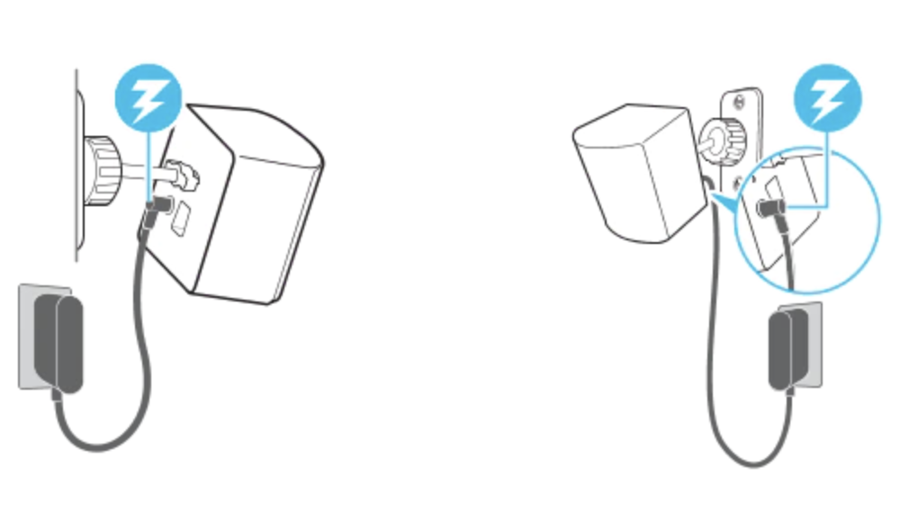

# Set Up Guide

## Virtual Reality

There are a few steps to set up a VR space before starting to use it.

{width=400}

Step 1 - Make Sure to Have Plenty of Space

It is better to have more space for VR setup, at least 6.5 x 5 feet is recommended. Chairs, tables, and anything you can bump into while using VR should be kept away from the VR space to avoid tripping hazards. You should also consider having enough airspace, for example low ceilings, or dangling ceiling lights that you can easily touch on are not recommended. Finally, try to avoid reflective surfaces and windows while using VR because they might cause tracking issues of the headset and controller and make your view spin out of control.

Step 2 - Setup the Base Station

VR headsets and controllers rely on base stations for tracking their exact locations in order to create the illusion of room-scale immersion in virtual reality. It usually comes with two base stations to help the VR work. To set up Base stations, it needs to be diagonally mounted across from each other and above the head, solidly to avoid wobble. There are few ways to mount the base station. You can choose to mount it into the wall which is the most ideal way to save spaces and usually it’s more stable. 
{width=250}

You can also mount it on camera tripod stands, which you can easily move around, but it will take up floor space and maybe it will get in your way when you use it.

{width=250}

## WiFi and Troubleshooting Help

One recurring problem in today's world is issues with your wireless connection. Like in other consoles and devices, a virtual reality headset will still work without internet connectivity, however, any application that requires wifi will not load properly. If you are inside an app that is dependent on wifi connection, then usually a pop-up appears inside the VR headset screen, and it also usually allows users to try to reconnect/fix the problem without taking the headset off. Nonetheless, the application usually freezes until the problem is solved or the application is closed.

The following are a couple of links created by developers from some of the most popular VR brands that can help if you are having issues with your internet connection or you need troubleshooting assistance in general:

* https://store.facebook.com/help/quest/articles/fix-a-problem/troubleshoot-headsets-and-accessories/trouble-connecting-to-wifi-quest-2-or-quest/

* https://www.vive.com/us/support/vive/category_howto/troubleshooting-headset-display.html 

* https://www.playstation.com/en-us/support/hardware/playstation-vr-troubleshooting/

