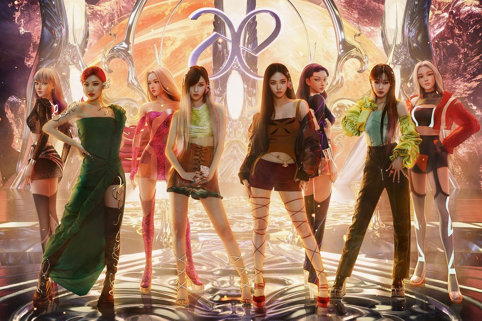

# Company Use

## Internal Opportunities for Companies

As previously stated, VR can also be used by companies to enhance their collaboration in team settings. Our team brainstormed three possible ways that companies could choose to adopt virtual reality. They could (hopefully) provide remote employees with a VR headset to use instead of video communication platforms such as Zoom. The employee can set up a designated room in their home that they will use whenever they are asked to enter a meeting or work on a specific project with a team member. Another way to use VR is to have some specified VR rooms within their buildings which allows for fast communication with international branches or clients physically far away, again, replacing application such as Zoom. Finally, companies could include VR headsets in meeting rooms in their buildings. This would allow presenters to integrate the benefits of virtual reality into their presentations. Similar to the education examples, the presenter could ask the audience (who are in the same physical room) to quickly put on the VR headsets (which are supposed to be in close proximity to them) for their next segment of the presentation which could be a simulation of a business decision for example. 

## Commerce & Entertainment

With the rise of digital commerce, the Metaverse will unlock new opportunities for buyers and sellers to connect in a new way. You could imagine your shop on Instagram becoming more immersive, with the option to buy physical or digital products.

**NFT Innovation in Commerce**

{width=300}

One of the most popular commerce products in the Metaverse is the NFT, which stands for non-fungible token. “Non-fungible” means that its unique and can not be replaced with something else. For example, a one-of-a-kind trading card is non-fungible. If you traded it for a different card, you would have something completely different. NFTs can really be anything digital (such as drawings, music, or your brain downloaded and turned into an AI), but a lot of the current excitement is around using the tech to sell digital art. NFTs are designed to give you something that can’t be copied: ownership of the work (though the artist can still retain the copyright and reproduction rights, just like with physical artwork). To put it in terms of physical art collecting: anyone can buy a Monet print, but only one person can own the original. 

**The Metaverse Application in Aespa**

There are also many uses for VR and the Metaverse in the Entertainment industry. For example, today you can host a paid online event on Facebook, but imagine if you could make this a mixed-reality experience where people could join in person or buy a ticket for the virtual experience. We saw this during the Facebook 2021 Connect event when two friends were able to enjoy the same concert, one in person and the other joining in the Metaverse.

{width=300}

The Aespa girl group debuted in 2020 and made the first move into the meta-universe market for the K-pop market. Aespa is the group formed by 8 people, but technically only 4 real humans and their respective virtual counterparts. This concept of combining teams and The Metaverse has been strongly welcomed by Generation Z. Each music video is interspersed with a large amount of the Metaverse concepts, visual sound effects, and avatars performance. And this concept is also widely used in their CD products, by scanning the QR code on the CD, fans can view the videos and voices recorded by Aespa members through the mobile phone app, or interact with their avatars. The Metaverse market concept has brought extremely popularity to Aespa, and also made K-pop realize the power of the Metaverse concept. Perhaps in the future, we will see more music groups using the concept of Metaverse.

